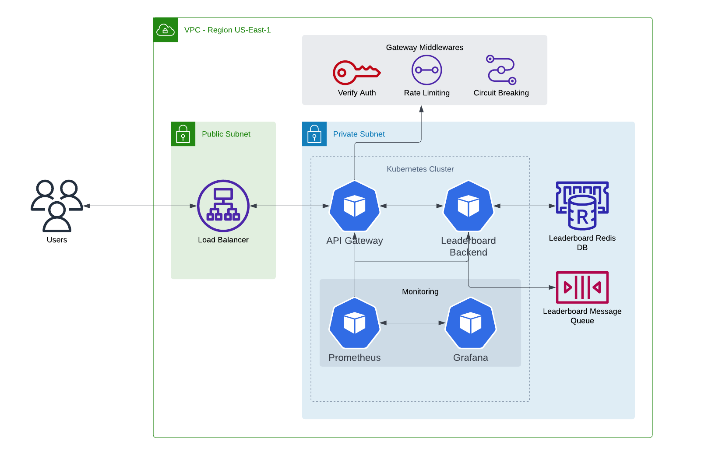

# Systems Design - Leaderboard

## About
We need to build an interactive web based client leaderboard for one of Epic's online multi-player games. This document will attempt to outline requirements and possible design choices for such a system.

### Requirements

> * Leaderboards are based on the total number of eliminations across all games played
by a user and:
>    * Are per game mode (there are 4 of them)
>    * Have daily / weekly / all-time aggregations
>    * Have user driven filtering capabilities (friends, groups, recently played with, etc)
> * Handle the user base for the game with up to 10 million concurrent players and on
average 10,000 game matches end every minute
> * The user-facing leaderboard is viewed after every match
> * The downstream leaderboard backend exposes a set of RESTful APIs over HTTP(S)
for retrieving the leaderboard data.
> * The backend also will collect the information about the eliminations and is not
required for this exercise

## Thoughts
Based on the description and requirements there are a few experiences/ interfaces we need to support:
1. Web front end for serving leaderboards to users on the web
2. Rendering the leaderboards UI in a client side application
3. Backend API to handle leaderboard data

### Assumptions
I'll make a few assumptions throughout the document:
* We already have a functioning kubernetes environment to deploy to
* We have an existing API gateway backend to tap into to move common security logic out of the application and into the infrastructure layer. Or at the very least an OAuth system to use for token introspection

### Constraints
There is a few constraints that come to mind initially:
1. Network throughput in terms of `(raw requests * bytes per request per second)`
2. Database read/ write requests per second
3. Front end rendering service throughput/ cpu usage
4. Backend api requests per second throughput

### Mitigations
1. In a lot of cloud environments network throughput is tied to cpu size. We may have to over provision cpu size to account for more networking throughput based on request body average byte size and requests per second
2. We can usually scale database cpu/ memory size to a limited high mark amount. In this case of using a redis database cluster with ordered sets, we can test and assume certain performance metrics as defaults. Set size in redis is limited to 32 bit keys which means a high end of ~4.2 billion items per set. If we need to exceed the max set size we can use a hash ring algorithm to place items in multiple redis DBs based on player ID
3. We can serve the front end rendering via a separate front end microservice, or include it as part of the backend in a monolith type fashion. We could then use a kubernetes horizontal pod autoscaler to scale the backend based on cpu/ memory usage
4. Similar to point 3 we can use a kubernetes horizontal pod autoscaler to scale up pods based on cpu/ memory usage

### Front End
For the front end rendering I'd probably recommend using a react tech stack with a redux like state store. It's the most common framework right now and the odds of other engineers having expertise is pretty high. This would help make it more maintainable long term.

Another consideration is that we need to render the leaderboard UI both on the server, as well as inside a web view in a client such as a browser or game client. With a javascript based framework we can render the views the same in multiple environments.

### Back End
For the back end tech stack pretty much anything would work here. Based on the metrics of 10k matches per minute, that works out to roughly ~167 requests per second, which should easily be achieved in pretty much any backend language. I would probably stick with javascript/typescript so we can use the same react code on the backend and front end rendering.

Go would be nice also because it doesn't have GC pauses, but server side rendering support for react becomes an issue. We would then have to run two separate services for backend and front end. I would prefer to keep them together for simplicity of development. Unless there was a strong need to separate the front end and backend into individual micro-services.

The tech stack I would land on would be something like:
* Docker package format
* Typescript source language
* SWC compiler for ts
* Node runtime
* Mocha for unit tests
* Gulp for build tasks if needed
* Express for the web framework
* OpenTelemetry for exposing prometheus metrics and tracing
* Pino for structured logging
* React for UI rendering

I would then move auth token verification, request signing, rate limiting, etc to the api gateway layer. This would help keep the app light and stateless and easy to scale and maintain.

### Data
In terms of data structures we'd need some sort of sorted set to store the data. So for the database I'd recommend using redis since it has support for [sorted sets](https://redis.io/docs/data-types/sorted-sets/) out of the box. We could use methods like `ZADD` to add new user data to the set and `ZRANK` and `ZRANGE` to return a range of leaderboard data to show on the web UI.

Another potential temporary data store would be a message queue like `SQS` or something similar. We could use it as a type of dead-letter queue for failed writes to try again at a later date. Or we could proxy all writes through the message queue and use worker threads to write to the redis DB based on capacity so we don't overload the DB.

### Aggregations
To create the daily/ weekly/ all-time aggregations we can tap into a BI type worker system (like [airflow](https://airflow.apache.org)) and run jobs on schedule to aggregate the data into separate redis DBs and/ or a type of data warehouse DB.

## Talking Points

### Durability
A. Scalability - Handling scalability (user count going up 10x):
* Utilize horizontal pod autoscalers in kubernetes to increase the number of pods based on cpu/ memory usage automatically (say around ~70% or so). This works well and also scales back down automatically as traffic lowers
* Provide a minimum set number of pods provisioned slightly over normal capacity to handle small bursts

B. Reliability - Improving reliability (preventing failures):
* Run a test suite on deploys that prevents deployment on failures
* Run a development and/ or staging cluster to do test runs before deploying to production
* Utilize blue/ green deployment strategies - Where we deploy the new pod version, wait until it's running successfully, then drain the old pods and cut over traffic. In the event of a failed deploy the old version is still running. This would help achieve zero-downtime deploys
* Utilize an API gateway and implement a circuit breaking pattern to forward requests to either an old version of the application, or a different region if a backend becomes unavailable
* Implement rate limiting - This would prevent individual users from ddosing the service by sending too many requests
* Move things like authentication, rate limiting, request signing, circuit breaking, etc outside the application and into the infrastructure layer via an api gateway. This can help keep the code simple and stateless and easy to scale
* Implement exhaustive error handling and logging best practices so we can catch all errors and monitor and track them

C. Resilience - Graceful degradation in the event the datastore is overloaded:
* In the case of `GET` requests we could read data from a read-only replica. It may not be the most up to date or accurate data, but at least it is usable and the end user experience is less impacted
* In the case of `POST` requests of new data to store in the DB we could send the data to a type of dead-letter queue or sqs queue on write failure. Then when the service has either scaled or has capacity to write again we could use worker threads to iterate and retry all the failed writes to ensure we don't miss any data. In the short term the leaderboard data may not be completely up to date, but would eventually get there
* Handle errors gracefully throughout the backend application and return error responses with custom error codes and messages that make implementing error states in the end user UI very easy. In the case of actual unrecoverable errors it's important to let the user know what happened if we can
* The datastore should also be backed up to disk regularly so it can be rebuilt in cases of shutdown or disaster
* Support graceful shutdown logic in the backend so we can flush data on failure and not miss any writes

D. Telemetry - Some metrics we could collect and how to use them:
* Request path, method, and count
* Error rate counts
* Read/ write counts to the DB
* Network bytes in/ out
* DB cpu/ memory utilization, disk read/ writes, network throughput, errors
* App cpu/ memory utilization, GC times, event loop delay
* Request traces (spans)
* In terms of usage most of the metrics can be used to create dashboards in grafana to monitor application health. We could then create alerts in grafana using error rates, cpu/ memory stats, and event loop delay to try and catch major issues ahead of time
* Traces (spans) are very helpful to view and debug the whole path of requests from the API gateway to the app to the DB and anything else in between
* A lot of this data can be tracked centrally via an api gateway metrics interface which can be exposed via prometheus. This simplifies a lot of the metrics and tracing implementation and can be audited and consistent with other applications

E. Bottlenecks - What bottlenecks exist and how to mitigate:
* Any time you need to read/ write to a database it automatically becomes a bottleneck. In order to mitigate this we can read from read-only replicas that are kept eventually in sync with the database master. We could also prevent writing directly to the database and instead post all write requests to a message queue. We would then use a pool of worker threads to process the writes based on system throughput availability
* Request handling per application backend. To mitigate this we'd need to do testing to verify the possible throughput of the api backend so we can set the pod min /max limits accordingly. We can use HPAs to scale the backend kubernetes deployments
* Network throughput in/ out bytes per second. This can usually be mitigated by increasing cpu size on the kubernetes nodes
* Possible IP exhaustion for pods depending on how many are already running in the cluster and per node. EKS has limits on [max pods per node](https://github.com/awslabs/amazon-eks-ami/blob/master/files/eni-max-pods.txt) based on the network interface and cpu size. The mitigation here would be to increase cpu size based on how many pods we expect to run on each node. We would also want to verify the subnet CIDR range for pods in EKS so we have enough capacity to scale
* There is also bottlenecks on any external service that would be used. This includes the API gateway layer which would also need to scale, as well as the OAuth system for authenticating users. This can be mitigated by working with teams that maintain those tools and accounting for the extra capacity of the new proposed leaderboard application

## Diagrams
Example cloud architecture diagram:
